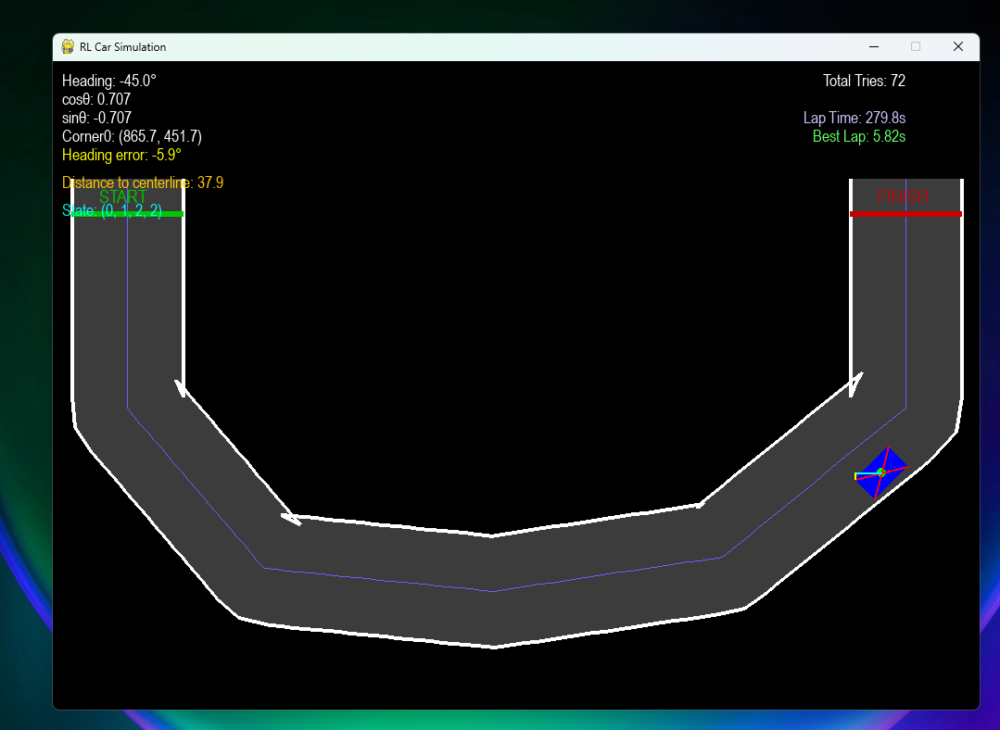

# Reinforcement Learning Car Simulation (Q-Learning from Scratch)

This project is a **from-scratch Reinforcement Learning (RL) car simulation** built using **Python and Pygame**, where an autonomous car learns to drive around a track using **tabular Q-learning**.

The goal of this project was not just to make the car move, but to **understand RL deeply** — state design, action abstraction, reward shaping, debugging learning failures, and measuring real progress.

## Environment Overview

- **2D track** rendered in Pygame  
- Road represented as a polygon with collision detection  
- Car modeled with:
  - Position (x, y)
  - Heading (degrees)
  - Speed and acceleration
  - Rectangle-based collision geometry

Each episode corresponds to **one lap attempt**.

## Action Space (Discrete)

The agent has **9 discrete actions**, carefully designed to balance control and simplicity

| Action ID | Description |
| :--- | :--- |
| 0 | Idle |
| 1 | Accelerate |
| 2 | Brake |
| 3 | Turn Left |
| 4 | Left + Accelerate |
| 5 | Left + Brake |
| 6 | Turn Right |
| 7 | Right + Accelerate |
| 8 | Right + Brake |

This action design lets the agent learn *compound behaviors* instead of fighting the physics.

## State Representation (Key Insight)

One of the hardest and most important parts of this project.

The continuous world is discretized into a **compact but expressive state**:

### 1. Speed
- STOPPED
- SLOW
- FAST

### 2. Heading Error (current)
Angle between car heading and local road direction:
- HARD_LEFT
- LEFT
- STRAIGHT
- RIGHT
- HARD_RIGHT

### 3. Distance from Centerline
- CENTER
- OFF_CENTER
- FAR

### 4. Future Heading Error (lookahead)

This was a **major learning breakthrough**.

Instead of reacting late, the agent gets a preview of the road curvature:
- FUTURE_LEFT
- FUTURE_STRAIGHT
- FUTURE_RIGHT

This single addition dramatically stabilized learning and cornering.

##  Reward Function Design

Reward shaping was iterative and heavily debugged.

Final reward components:

- Forward progress toward finish line
- Small reward for maintaining positive speed
-  Penalty for heading misalignment
-  Penalty for distance from centerline
-  Heavy penalty for collisions
-  Large terminal reward for completing a lap

This balances *speed*, *stability*, and *track adherence*.

**Built with curiosity, frustration, and a lot of debugging ;)**

Best lap time yet: 5.82s

