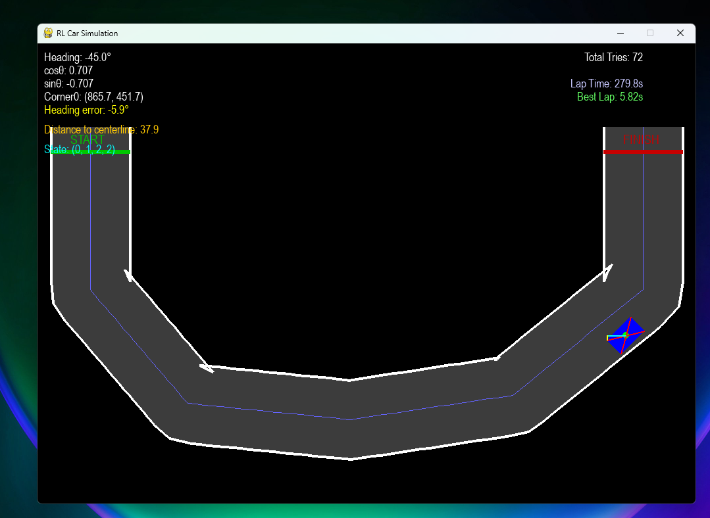

## 🛠️ Local Setup & Running the Project

This project is intentionally lightweight and easy to run locally.  
No deep learning frameworks or GPUs required.

---

### ✅ Prerequisites

- Python **3.8+**
- pip
- A machine that can run Pygame (Windows / macOS / Linux)

---

### 📦 Installation

1️⃣ **Clone the repository**
```bash
git clone https://github.com/hemant-mistry/self-driving-rl.git
cd self-driving-rl
```

2️⃣ Create and activate a virtual environment (recommended)
```bash
python -m venv venv
venv\Scripts\activate
```

3️⃣ Install dependencies
```
pip install pygame
```
That’s it — no additional libraries required.

▶️ Running the Simulation

From the project root directory:
```
python main.py
```
A Pygame window will open showing the track and the RL-controlled car.

### The current best lap time is: 5.82s

